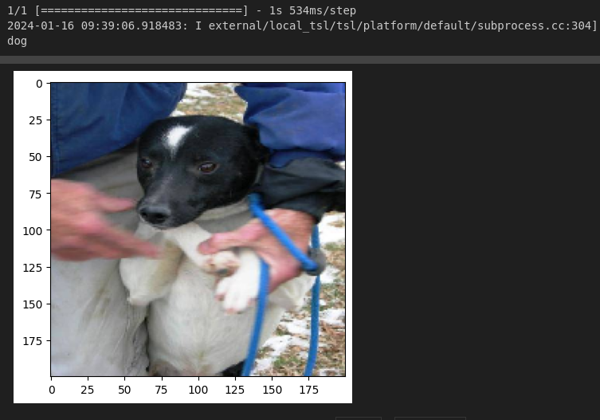

# Deep Learning Exercise

This repository contains a deep learning model implemented with a convolutional neural network (CNN) for classifying images of dogs and cats. The model has been trained using a comprehensive dataset and is expected to generalize well for new images of dogs and cats.

The model is not in the models folder because it has a weight greater than 100mb but inside is the code I used to generate it.
## Content

- [Usage](#usage)
- [Examples](#examples)
- [Project Structure](#project-structure)
- [Contribution](#contribution)

## Usage

Open the `src` folder and explore the jupyter notebooks

## Examples

Here is an image of a dog correctly predicted by the model. 

## Project Structure

- `models/`: Stores the trained model (if applicable).
- `data/`: Directory to store the training and testing datasets.
- `src/`: Contains the source code for the project.
- `docs/`: Documentation files for the project.
- `README.md`: Project documentation.

## Contribution

Contributions are welcome! If you find any issues or have improvements, please open an issue or submit a pull request.

